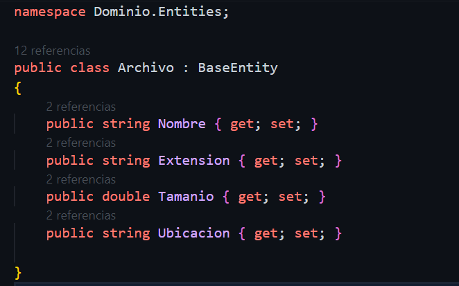

# UploadFiles-Campus

Descripción
Este proyecto proporciona una aplicación que permite a los usuarios subir, descargar y gestionar archivos. La aplicación está diseñada para ser una solución simple y efectiva para el almacenamiento y gestión de archivos en una aplicación web. Los usuarios pueden cargar archivos, ver una lista de archivos existentes, descargar archivos y eliminar archivos no deseados.

Archivo.cs

Esta clase representa una entidad de archivo en el dominio de la aplicación. Almacena información sobre un archivo, como su nombre, extensión, tamaño y ubicación.

IArchivo.cs
Esta interfaz define los métodos que deben implementarse para manejar archivos en la aplicación. Incluye métodos para guardar documentos, obtener documentos y otros métodos relacionados con archivos.

DbAppContext.cs
Esta clase representa el contexto de la base de datos de la aplicación. Define las tablas de base de datos y configura las relaciones entre las entidades.

UnitOfWork.cs
Esta clase se encarga de administrar las operaciones relacionadas con archivos en la aplicación. Proporciona métodos para acceder a las operaciones de archivos.

ArchivoRepository.cs
Esta clase implementa la interfaz IArchivo y proporciona la lógica concreta para interactuar con archivos en la base de datos y en el sistema de archivos. Incluye métodos para guardar y obtener documentos.

ArchivoController.cs
Este controlador define las rutas y acciones para manejar operaciones relacionadas con archivos, como subir, descargar y eliminar archivos. Utiliza los métodos proporcionados por UnitOfWork para realizar estas operaciones.
