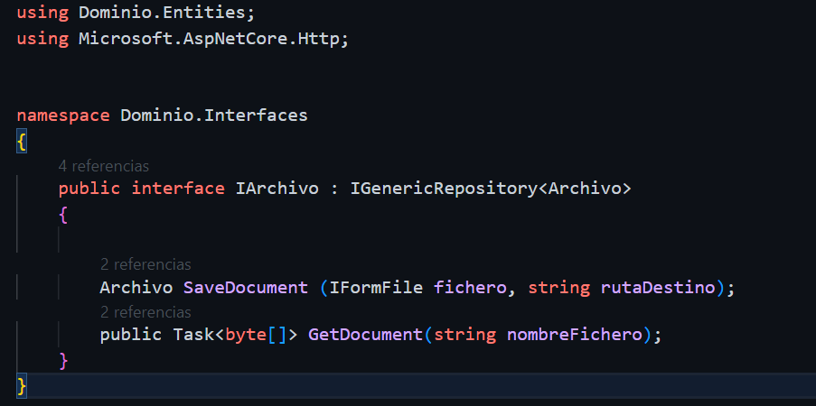
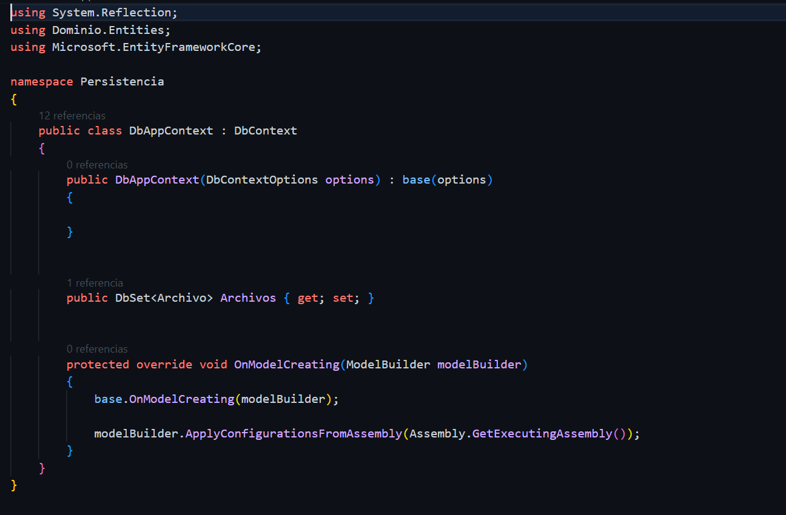
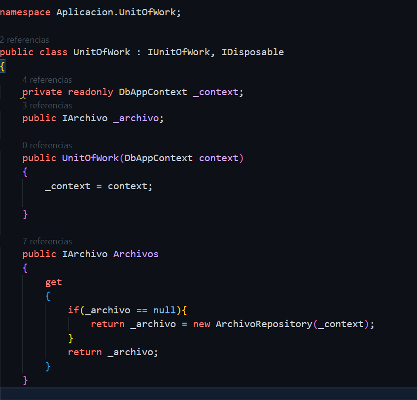
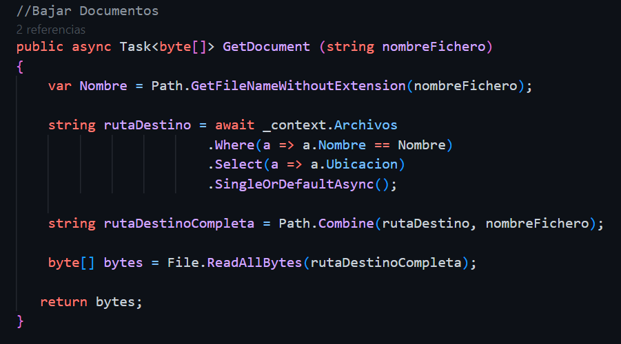
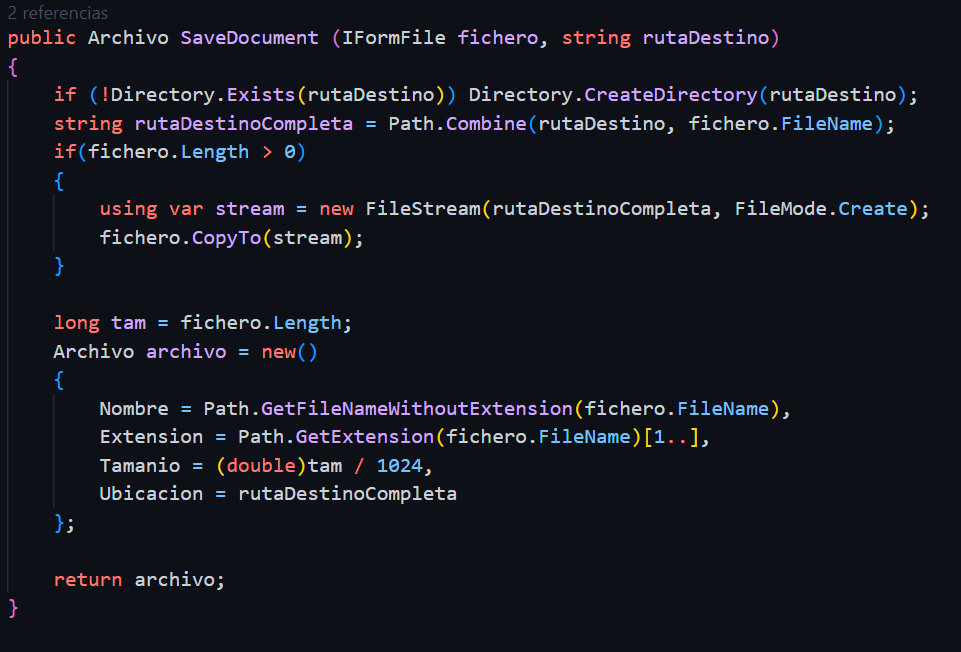
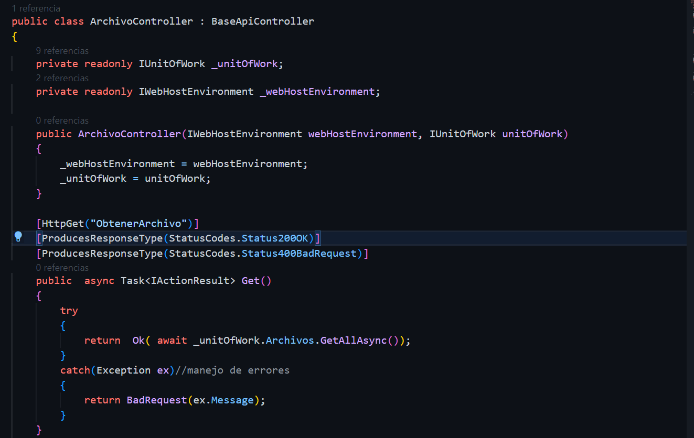
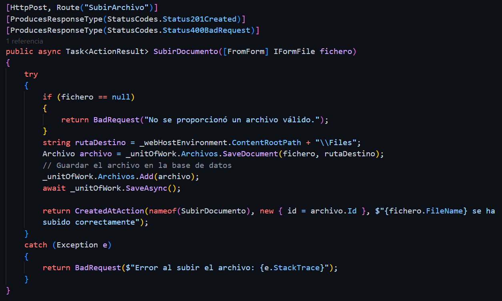
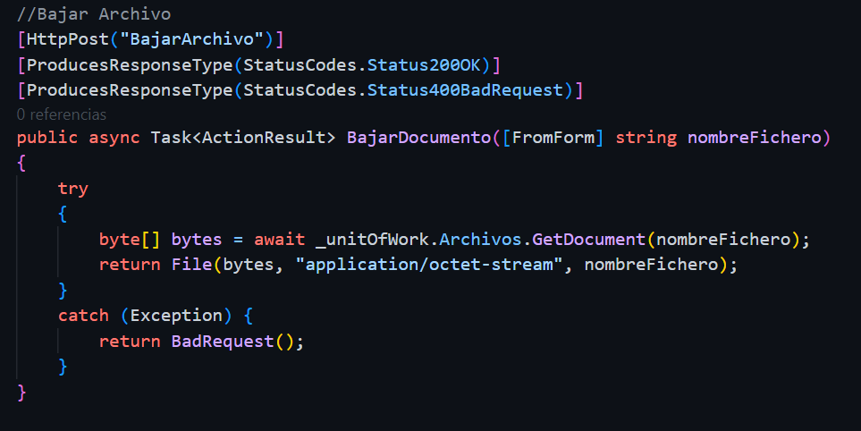
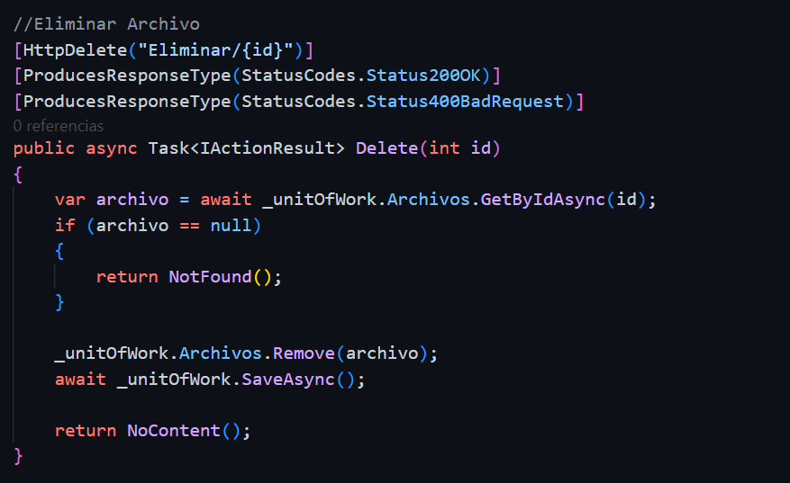

<h1>SUBIR Y BAJAR ARCHIVOS </h1>

<h2>Descripción</h2>

Descripción general de tu proyecto. Puedes proporcionar una breve introducción a lo que hace tu aplicación y por qué es útil.

<h2>Capturas de Pantalla</h2>

A continuación, se presentan algunas capturas de pantalla de las clases principales de la aplicación:

<h3>Archivo.cs</h3>

Esta clase representa una entidad de archivo en el dominio de la aplicación. Almacena información sobre un archivo, como su nombre, extensión, tamaño y ubicación.

<h3>IArchivo.cs </h3>

Esta interfaz define los métodos que deben implementarse para manejar archivos en la aplicación. Incluye métodos para guardar documentos, obtener documentos y otros métodos relacionados con archivos.

<h3>DbAppContext.cs</h3>

Esta clase representa el contexto de la base de datos de la aplicación. Define las tablas de base de datos y configura las relaciones entre las entidades.

<h3>UnitOfWork.cs</h3>

Esta clase implementa el patrón Unit of Work y se encarga de administrar las operaciones relacionadas con archivos en la aplicación. Proporciona métodos para acceder a las operaciones de archivos.

<h3>ArchivoRepository.cs</h3>

Esta clase implementa la interfaz IArchivo y proporciona la lógica concreta para interactuar con archivos en la base de datos y en el sistema de archivos. Incluye métodos para guardar y obtener documentos.

<h3>ArchivoController.cs </h3>

Este controlador define las rutas y acciones para manejar operaciones relacionadas con archivos, como subir, descargar y eliminar archivos. Utiliza los métodos proporcionados por UnitOfWork para realizar estas operaciones.

 En esta peticion, se obtienen todos los archivos disponibles en la base de datos y se devuelven como una respuesta HTTP. Esto permite a los usuarios listar y acceder a todos los archivos disponibles en la aplicación. 

En este controlador, se toma el nombre del archivo como entrada y se utiliza para obtener la ruta del archivo deseado. Luego, el contenido del archivo se devuelve como una respuesta HTTP para su descarga. 

Este controlador se encarga de recibir un archivo como entrada y guardar dicho archivo en el sistema de archivos y en la base de datos. Luego, devuelve una respuesta HTTP indicando si la operación de carga fue exitosa.

 En este controlador, se elimina un archivo de la base de datos utilizando su identificador único (ID). Si la eliminación tiene éxito, se devuelve una respuesta HTTP indicando que el archivo se ha eliminado correctamente.

